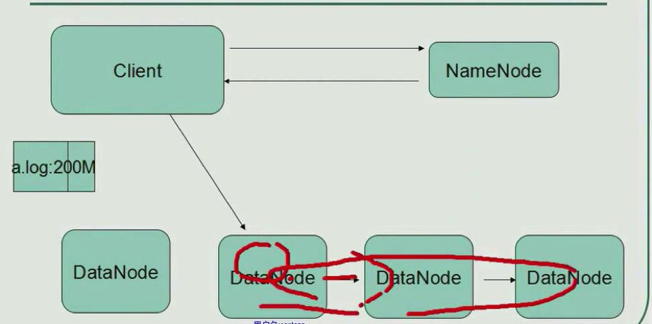
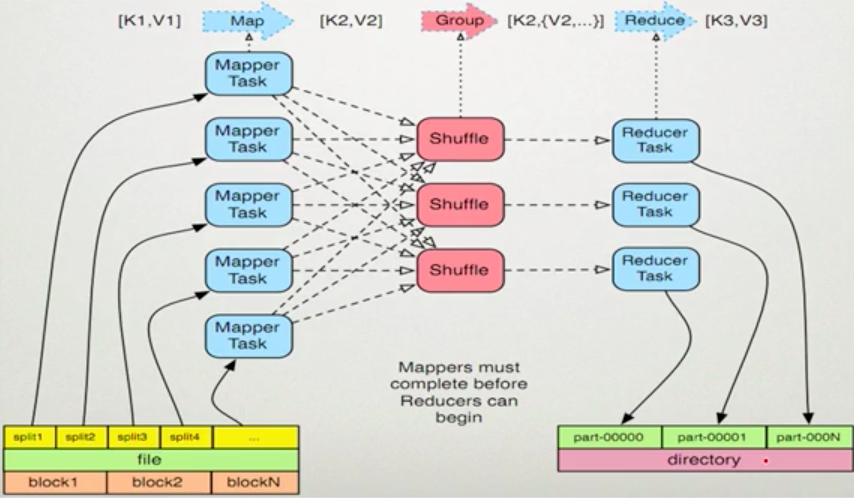
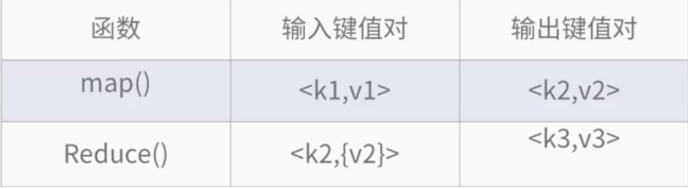
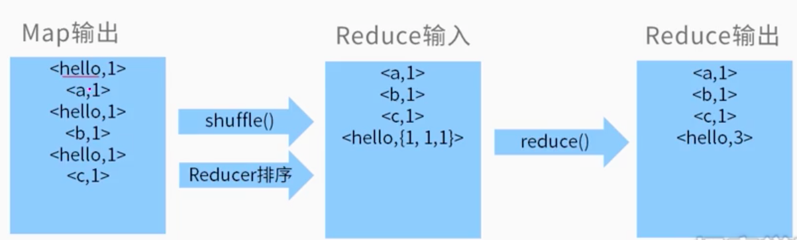

## introduce
HDFS 		  ---海量数据存储    
MapReduce  ---分布式计算模型   海量数据分析   
Yarn               ---资源管理调度系统 (支持spark、storm用于推荐、Hive、Hbase)     
Hadoop 	  ---海量数据离线处理     

HDFS       
	主节点 namenokde    
	从节点 datanodes
  

Hadoop   
部署方式  
> 本地模式  
	  伪分布模式  
	  集群模式

## install
参考http://www.jianshu.com/p/3aebdba32363    

在/usr/local/Cellar/hadoop/2.8.0/sbin目录下, 执行如下命令

> $ ./start-dfs.sh  #启动HDFS
$ ./stop-dfs.sh  #停止HDFS

在浏览器打开
http://localhost:50070/dfshealth.html#tab-overview

## 配置环境变量
> export JAVA_HOME=/Library/Java/JavaVirtualMachines/jdk1.8.0_101.jdk/Contents/Home    
export JRE_HOME=$JAVA_HOME/jre    
export HADOOP_HOME=/usr/local/Cellar/hadoop/2.8.0   
export CLASSPATH=$JAVA_HOME/lib:$JRE_HOME/lib:$CLASSPATH    
export HADOOP_HOME_WARN_SUPPRESS=1    
export PATH=$JAVA_HOME/bin:$JRE_HOME/bin:$HADOOP_HOME/bin:$PATH

其中：

export JAVA_HOME=/Library/Java/JavaVirtualMachines/jdk1.8.0_101.jdk/Contents/Home
export JRE_HOME=$JAVA_HOME/jre
是java的系统环境变量。

export HADOOP_HOME=/Users/Apple/Documents/hadoop-1.2.1
是配置Hadoop的系统环境变量

export HADOOP_HOME_WARN_SUPPRESS=1
是防止出现：Warning: $HADOOP_HOME is deprecated的警告错误。
上述环境变量增加完成后，退回到终端，输入：

> source ~/.bash_profile

使得环境变量设置生效！

## introduce
用户只需要实现map() reduce()这两个函数，即可实现分布式计算

map reduce形参： key value对，表示函数的输入信息

特点：
  高容错、高扩展、编程简单、适合大数据离线批量处理

图解：

### map任务处理过程
1.读取文件内容，解析成key value对。输入文件的每一行解析成key value对。每个键值对调用一次map函数。

2.写自己的逻辑，将输入的key value键值对转换成新的key value输出

3.对输出的key value进行分区

4.对不同分区的数据按照key值排序、分组，将相同key值的value放到同一集合

5.分组后的数据进行规约

### reduce任务处理
1.将多个map数据的输出按照不同的分区，通过网络copy到不同reduce节点。

2.将map输出合并 排序。写reduce自己逻辑，处理key value 转换成新的key value 输出

3.将reduce输出保存到文件

### 键值对格式

### MR过程
- jobClient:提交作业

- JobTracker:初始化作业 分配作业

- TaskTracker:定期与JobTracker通信，执行map reduce任务

localizeJob()  launchTaskForJob()

- HDFS:保存作业的数据 配置 jar包 结果

## 词频统计过程

